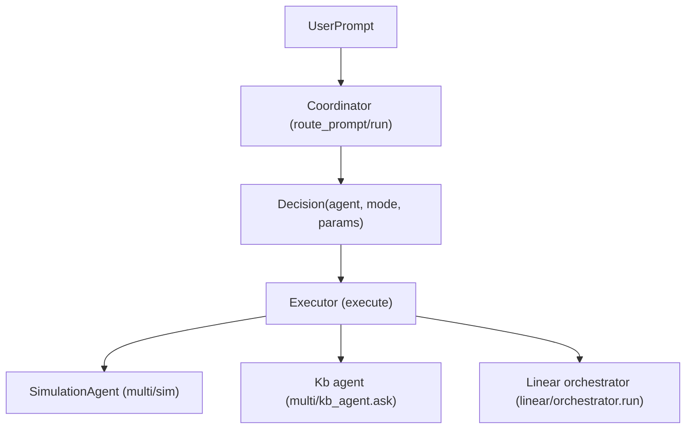

# Architecture

## Layout

- All application code lives under **`src/`**.
- Config and env stay at project root: `.env`, `requirements.txt`, `ARCHITECTURE.md`.

## LLM Wrapper

- **`src/wrapper.py`**: Single module that exposes a unified chat interface and switches between LLM providers via environment variable.
- **Interface**: `complete(messages: list[dict]) -> str`
  - **Input**: List of message dicts with `role` (`"user"`, `"assistant"`, `"system"`) and `content` (string).
  - **Output**: Assistant reply as a single string.
- **Default provider**: OpenAI. Set `LLM_PROVIDER=anthropic` in `.env` to use Anthropic.

## Environment variables

| Variable | Purpose |
|----------|---------|
| `LLM_PROVIDER` | `openai` (default) or `anthropic` |
| `OPENAI_API_KEY` | OpenAI API key (required when provider is openai) |
| `ANTHROPIC_API_KEY` | Anthropic API key (required when provider is anthropic) |
| `OPENAI_MODEL` | OpenAI model (default: gpt-4o-mini) |
| `ANTHROPIC_MODEL` | Anthropic model (default: claude-sonnet-4-6) |
| `MAX_TOKENS` | Max tokens for Anthropic (default: 1024) |

Load from `.env` via `python-dotenv` (called in `src/wrapper.py` on import).

## Linear pipeline

- **`src/linear/`**: Linear LLM pipeline. First step is the **extractor**.
- **`src/linear/extractor.py`**: Structured extraction from task descriptions.
  - **Interface**: `extract(text: str) -> dict`
  - **Input**: Raw task description (e.g. material/simulation prompt).
  - **Output**: Parsed dict matching the material/simulation schema (top-level keys: `material_system`, `processing_conditions`, `simulation_parameters`, `computed_properties`, `uncertainty_estimates`).
  - **Provider**: Uses `LLM_PROVIDER` (same as wrapper). **OpenAI**: Structured Outputs via `response_format` and `json_schema`. **Anthropic**: Tool use (single tool with `input_schema`, optional `strict`). Reuses `OPENAI_MODEL`, `ANTHROPIC_MODEL`, `MAX_TOKENS`; no new env vars or dependencies.
- **`src/linear/processor.py`**: LLM-based symbolic reasoning on extraction-shaped data. Uses `src.wrapper.complete` only (no direct provider calls).
  - **Interface**: `process(data: dict, task: str) -> dict`
  - **Input**: `data` = extraction dict (output of `extract(...)`); `task` = one of `schema_validation`, `constraint_verification`, `feature_extraction`, `normalization`, `risk_ranking`.
  - **Output**: Task-specific result dict (e.g. schema_validation → `{"valid": bool, "issues": list[str]}`; constraint_verification → `{"plausible": bool, "warnings": list[str]}`; etc.).
  - **Tasks**: Schema validation (percentage sums, missing fields, contradictions); constraint verification (temp vs melting, strain rate, model vs scale); feature extraction (alloy class, functional category, mechanism, dimensionality); normalization (composition to fractions, temp range to array, units); risk/sensitivity ranking (property and processing rankings).
- **`src/linear/reasoning.py`**: LLM agent that produces a human-readable summary of pipeline execution. Aware of `src/linear/` structure (extractor, processor, task names and output shapes). Uses `src.wrapper.complete`.
  - **Interface**: `summarize(original_input: str, extraction: dict, processing_results: dict) -> str`
  - **Input**: Original task text, extraction dict, and a dict mapping task name → process result.
  - **Output**: Concise human-readable summary of actions taken and results obtained (no raw JSON).
- **`src/linear/orchestrator.py`**: Orchestrates the pipeline: passes input from extract → process (one or more tasks) → reasoning.
  - **Interface**: `run(input_text: str, tasks: list[str] | None = None) -> dict`
  - **Input**: Raw task description; optional list of processor task names (default: all TASKS).
  - **Output**: `{"summary": str, "extraction": dict, "processing": dict}` — human-readable summary plus full extraction and per-task results.
- **`src/linear/__init__.py`**: Exposes `extract`, `process`, `summarize`, `run`, and task constants (e.g. `from src.linear import extract, process, summarize, run, TASK_SCHEMA_VALIDATION`).

## Multi / Knowledge-Base

- **`src/multi/`**: Provider-agnostic RAG module for document indexing, retrieval, and augmented completion.
- Files:
  - **`knowledge_base.py`**: Core logic for indexing, chunking, embedding, storage, and search.
  - **`wrapper.py`**: Augmented completion entry point.
  - **`__init__.py`**: Re-exports `index`, `search`, `clear`, `store_size`, `complete_with_knowledge`.
- **Public API**: `from src.multi import index, search, clear, store_size, complete_with_knowledge`
- **Interface**:
  - `index(paths: list[str]) -> None`: Ingest documents or raw text.
  - `search(query: str, top_k: int = 5) -> list[dict]`: Retrieve top-k relevant chunks.
  - `complete_with_knowledge(messages: list[dict], query: str, top_k: int = 5) -> str`: Augment and complete.
  - `clear() -> None`: Reset in-memory store.
  - `store_size() -> int`: Get current number of stored chunks (for testing).
- **Storage**: In-memory list; no persistent DB.
- **Embeddings**: Uses OpenAI API (requires `OPENAI_API_KEY`).
- **New Environment Variables** (optional):

| Variable          | Purpose                                                        |
| ----------------- | -------------------------------------------------------------- |
| `KB_DATA_DIR`     | Default directory to scan for documents (optional convenience) |
| `EMBEDDING_MODEL` | OpenAI embedding model (default: `text-embedding-3-small`)     |

- **Data Flow**:

```mermaid
graph TD
    A[User] -->|index(paths)| B[Ingest & Chunk]
    B --> C[Embed]
    C --> D[Store in _STORE]
    A -->|search(query)| E[Embed query]
    E --> F[Cosine similarity on _STORE]
    F --> G[Top-k results]
    A -->|complete_with_knowledge(messages, query)| H[search]
    H --> I[Augment messages<br/>(provider-specific)]
    I --> J[complete()]
```

## KB Agent

- **`src/multi/file_store.py`**: Provider-aware file storage layer.
  - **OpenAI**: Creates and manages an OpenAI vector store (`client.vector_stores`) and an Assistants API assistant (`client.beta.assistants`) with `file_search` enabled. Files are uploaded via `vector_stores.file_batches.upload_and_poll`. Queries run as assistant threads; `file_citation` annotations signal a successful retrieval.
  - **Anthropic**: Delegates directly to `knowledge_base.index()` (in-memory vector store).
  - **Interface**:
    - `upload_files(paths: list[str]) -> None`: Route file upload to the active provider.
    - `query_openai(query: str) -> str`: Query the OpenAI assistant; returns response text if citations found, `""` otherwise.
    - `clear_openai() -> None`: Reset OpenAI module-level store/assistant IDs.

- **`src/multi/kb_agent.py`**: Orchestration layer — KB first, web search fallback.
  - **Interface**: `ask(query: str) -> str`
  - **Provider dispatch**:

| `LLM_PROVIDER` | KB search | Fallback |
|---|---|---|
| `openai` | `query_openai()` — file_citation present? | `OpenAI().responses.create` with `web_search_preview` |
| `anthropic` | `search()` from `knowledge_base` — non-empty? | `Anthropic().messages.create` with `web_search_20250305` |

  - **Fallback trigger**: OpenAI — `query_openai()` returns `""`; Anthropic — `search()` returns `[]`.
  - Both web search mechanisms are **first-party** (no third-party service).

- **New Environment Variables** (optional):

| Variable | Purpose |
|---|---|
| `OPENAI_VECTOR_STORE_ID` | Pre-existing OpenAI vector store ID (created at runtime if absent) |
| `OPENAI_ASSISTANT_ID` | Pre-existing OpenAI assistant ID (created at runtime if absent) |

## Simulation agent

- **`src/multi/sim/`**: Toy nickel-based superalloy optimization (cooling rate → yield strength, porosity).
- **`src/multi/sim/simulation.py`**: `run_material_simulation(cooling_rate_K_per_min, duration_hours, ...)` → `(yield_strength_MPa, success)`.
- **`src/multi/sim/agent.py`**: `SimulationAgent` runs an optimization loop (simulate → LLM suggestion → repeat).
  - **`run_optimization_loop(initial_cooling_rate_K_per_min=..., on_step=...)`**: Optional `on_step(iteration, rate, y_MPa, success)` callback for per-step reporting.
  - **`run_and_report(initial_cooling_rate_K_per_min=...)`**: Returns `(history, output_string)`. Use `output_string` in chat so the user sees simulation output (each iteration + best result summary).
  - **`format_simulation_output(history, step_lines=None)`**: Formats history as a string for display; exported from `src.multi.sim`.

**Showing simulation output in chat**: Call `agent.run_and_report(...)` and display the second return value (e.g. `print(output)` or return it in a tool response).

## Coordinator and executor

- **`src/coordinator.py`**: Routing agent that decides which downstream LLM agent to call.
  - **Interface**:
    - `route_prompt(prompt: str) -> dict`: Inspect a raw user prompt and return a decision dict of the form `{"agent": "simulation" | "kb" | "processor", "mode": "pass_through" | "structured", "params": {...}}`.
    - `run(prompt: str) -> dict`: High-level entry point that calls `route_prompt` and then delegates to the executor to actually run the chosen agent.
  - **Agents**:
    - `simulation`: The material optimization loop implemented by `src/multi/sim/agent.py`.
    - `kb`: The knowledge-base + web-search agent implemented by `src/multi/kb_agent.py`.
    - `processor`: The structured materials/simulation analysis pipeline exposed via `src/linear/orchestrator.py`.
  - **LLM provider**: Uses `src.wrapper.complete`, so provider selection and API keys come from `.env` (`LLM_PROVIDER`, `OPENAI_API_KEY`, `ANTHROPIC_API_KEY`, etc.).
- **`src/executor.py`**: Executes a validated decision dict by calling the appropriate existing agent.
  - **Interface**:
    - `execute(decision: dict, original_prompt: str | None = None) -> dict`: Run the selected agent and return a normalized result dict.
  - **Behavior**:
    - `agent="simulation"`: Instantiate `SimulationAgent` and call `run_and_report(...)`; returns `{"history": [...], "output": str}` in the `result` field.
    - `agent="kb"`: Call `kb_agent.ask(query)` where `query` comes from `params["query"]` or falls back to `original_prompt`; returns the answer string in `result`.
    - `agent="processor"`: Call `linear.orchestrator.run(input_text, tasks=...)` where `input_text` is either `params["input_text"]` or `original_prompt`; returns the orchestrator dict (`summary`, `extraction`, `processing`) in `result`.



## Testing

This is an **LLM agent pipeline**. Integration tests must use the **real LLM with ZERO mocking of any kind** (no mocks, no patch, no monkeypatch). Every agent has E2E integration tests.

- **Integration tests (E2E, real LLM, zero mocking)**: `tests/integration/`
  - `tests/integration/wrapper/` — base wrapper `complete()` with live API.
  - `tests/integration/linear/` — linear pipeline: extract → process → summarize → run with live API (OpenAI; Anthropic skipped — extractor schema exceeds API union-type limit).
  - `tests/integration/multi/` — knowledge base, file store, kb_agent, complete_with_knowledge with live API.
  - `tests/integration/sim/` — simulation agent optimization loop with real LLM.
  - Require `OPENAI_API_KEY` and/or `ANTHROPIC_API_KEY` in `.env`; skipped when none set. For Anthropic-specific E2E, set `LLM_PROVIDER=anthropic` in `.env`.
  - Run: `python -m pytest tests/integration/ -v`
- **Unit tests (may mock LLM)**: `tests/test_*.py`
  - Fast feedback during development; they do **not** replace integration tests.
  - Run: `python -m pytest tests/ -v` (full suite includes both unit and integration).

## Tools

External computational tools that LLM pipelines can invoke are located under **`src/tools/`**. Each tool is self-contained: it includes its own Dockerfile, an in-container calculation script, and a host-side Python wrapper that the rest of the project imports.

### `src/tools/elastic_constants_lammps/`

Dockerised LAMMPS tool for computing the elastic constant tensor (C11, C12, C44) of FCC/BCC metals via EAM interatomic potentials.

**Files**

| File | Purpose |
|---|---|
| `Dockerfile` | Builds the container image from `condaforge/miniforge3:24.11.0-0`; installs LAMMPS `2024.08.29`, Python 3.12, numpy, and scipy from conda-forge; cleans caches to target ~1.2 GB final size. Tagged `elastic-lammps-tool:latest`. |
| `elastic_tool.py` | In-container calculation script (see CLI and algorithm below). |
| `host_wrapper.py` | Host-side Python module imported by LLM pipelines. Exports `compute_elastic_constants_tool`, `OPENAI_TOOL_SCHEMA`, and `ANTHROPIC_TOOL_SCHEMA`. Calls `docker run` via `subprocess.run` (no Docker SDK needed), captures JSON output from `elastic_tool.py`, and returns a result dict. |
| `README.md` | Setup and usage instructions: how to build the image, populate potential files, and invoke the tool from Python or directly with Docker. |
| `potentials/Al.eam.alloy` | Real EAM/alloy potential for Al — Mishin et al. (1999), *PRB* 59, 3393. |
| `potentials/Cu.eam.alloy` | Real EAM/alloy potential for Cu — Mishin et al. (2001), *PRB* 63, 224106. |
| `potentials/Ni.eam.alloy` | Real EAM/alloy potential for Ni — Mishin et al. (1999), *PRB* 59, 3393. |
| `potentials/Fe.eam.fs`    | Real EAM/fs potential for Fe — Mendelev et al. (2003), *Phil. Mag.* 83, 3977. |
| `potentials/W.eam.alloy`  | Real EAM/alloy potential for W — Zhou, Johnson, Wadley (2004), *PRB* 69, 144113. |
| `potentials/Mo.eam.alloy` | Real EAM/alloy potential for Mo — Zhou, Johnson, Wadley (2004), *PRB* 69, 144113. |

**`elastic_tool.py` CLI**:

```
--composition    (required)  Element symbol: Al, Cu, Ni, Fe, W, Mo
--potential      (optional)  Absolute path to EAM/alloy potential inside container (auto-resolved if omitted)
--supercell_size (default 4) Unit cells per axis (4 → 256 atoms for FCC)
```

**`elastic_tool.py` algorithm** (AtomAgents Voigt perturbation):

1. Copy the five AtomAgents input scripts (`in.elastic`, `displace.mod`, `init.mod`, `potential.mod`, `compliance.py`) verbatim from `/app/scripts/` into a temporary directory.
2. **Patch** the copies minimally:
   - `init.mod`: replace 4 Si-specific lines (lattice parameter, lattice type, region geometry, atomic mass).
   - `potential.mod`: replace 2 Si-specific lines (`pair_style`, `pair_coeff`). Copy to `potential.inp`.
   - `in.elastic`: append 3 `print` statements so LAMMPS emits `C11cubic`, `C12cubic`, `C44cubic` to `log.lammps` (variables are already computed internally).
3. **Run LAMMPS** via `subprocess.run(["lmp", "-in", "in.elastic"])`. LAMMPS applies 6 independent finite-strain perturbations (uxx, uyy, uzz, uyz, uxz, uxy), measures stress response for each, and computes the full 21-component Voigt elastic tensor. It then averages the three diagonal and three shear components to produce the cubic constants.
4. **Parse** `C11cubic`, `C12cubic`, `C44cubic` from `log.lammps` with a regex. Values are bounds-checked against (0, 2000) GPa.

**Output JSON**:

```json
{"composition": "Al", "C11": 114.3, "C12": 61.8, "C44": 31.6,
 "runtime_seconds": 52.1, "status": "ok"}
```

**Build the image** (run from `src/tools/elastic_constants_lammps/`):

```bash
docker build -t elastic-lammps-tool:latest .
```

**Integration with LLM pipelines**:

```python
from src.tools.elastic_constants_lammps.host_wrapper import compute_elastic_constants_tool

# Composition-only call — potential is resolved automatically
results = compute_elastic_constants_tool("Al")
# returns: {"composition": "Al", "C11": float, "C12": float, "C44": float,
#           "runtime_seconds": float, "status": "ok"}
```

**Automatic potential mapping** (`_DEFAULT_POTENTIALS` in `host_wrapper.py`):

Resolution order when `potential=None`:
1. Look up the element symbol in `_DEFAULT_POTENTIALS` (Al, Cu, Ni, Fe, W, Mo are pre-mapped).
2. Fall back to `/app/potentials/{composition}.eam.alloy` for unknown elements.
3. An explicit `potential` argument always overrides the mapping.

**Tool schemas**:

`host_wrapper.py` exports `OPENAI_TOOL_SCHEMA` and `ANTHROPIC_TOOL_SCHEMA` for direct use with provider clients:

```python
from src.tools.elastic_constants_lammps.host_wrapper import OPENAI_TOOL_SCHEMA, ANTHROPIC_TOOL_SCHEMA

# OpenAI
client.chat.completions.create(model="gpt-4o", messages=[...], tools=[OPENAI_TOOL_SCHEMA])

# Anthropic
client.messages.create(model="claude-sonnet-4-6", messages=[...], tools=[ANTHROPIC_TOOL_SCHEMA])
```

**Environment variables** (optional overrides read by `host_wrapper.py`):

| Variable | Purpose |
|---|---|
| `ELASTIC_IMAGE` | Docker image name (default: `elastic-lammps-tool:latest`) |

**Tests**:
- `tests/test_elastic_tool.py` — 24 unit tests covering element lookup, argparse, patch helpers, log parsing, subprocess wrapper, and JSON output schema. No LAMMPS or Docker required.
- `tests/test_host_wrapper.py` — 20 unit tests covering Docker command structure, automatic potential mapping, explicit override, error paths (timeout, FileNotFoundError, bad JSON, non-zero exit), env override, and schema structure. No Docker required.

---

## Tool Registry

**Location**: `src/tool_registry.py`

Central, extensible registry that maps tool names to callable Python functions and their provider-specific LLM schemas. All agents import from this single module — no agent needs to know the details of any tool.

### Public API

| Function | Purpose |
|---|---|
| `register(name, fn, openai_schema, anthropic_schema)` | Register a tool (called at module import time for built-in tools) |
| `get_openai_schemas()` | Return all OpenAI function-calling schema dicts |
| `get_anthropic_schemas()` | Return all Anthropic tool-use schema dicts |
| `get_entries()` | Return all entries as `{name, fn, openai_schema, anthropic_schema}` dicts |
| `call(name, kwargs)` | Execute a tool by name with given kwargs, return result dict |

`compute_elastic_constants_tool` from `src/tools/elastic_constants_lammps/host_wrapper.py` is registered automatically at module import.

**Extensibility**: adding a future tool requires a single `register()` call anywhere in the codebase — no changes to any agent or wrapper.

### `complete_with_tools` in `src/wrapper.py`

Tool-calling loop alongside the existing `complete()` function:

```python
MAX_TOOL_CALLS = 5

def complete_with_tools(messages, provider=None) -> str:
    ...
```

- **OpenAI**: sends `tools=get_openai_schemas()` to `chat.completions.create`, detects `tool_calls` on the response, executes each via `tool_registry.call`, appends `tool` role messages, loops.
- **Anthropic**: sends `tools=get_anthropic_schemas()`, detects `tool_use` content blocks, appends `tool_result` user blocks, loops.
- Logs each tool call: `[tool] <name> called — <elapsed>s — result status: <status>`.
- Hard guard: exits after `MAX_TOOL_CALLS = 5` iterations regardless of LLM behavior.

---

## Simulation Agent — Tool-Augmented Mode

**Location**: `src/multi/sim/agent.py`

### Pre-computation phase (Option A)

When `run_optimization_loop(use_tools=True)` or `run_and_report(use_tools=True)` is called:

1. `_prefetch_tool_context()` sends `_PREFETCH_PROMPT` to the LLM via `complete_with_tools`. The prompt invites (but does not command) the LLM to call any tools it judges relevant.
2. The LLM may call `compute_elastic_constants_tool` for constituent elements (Ni, Al, etc.) or return a plain text summary with no tool calls — its choice.
3. The response is stored in `self._tool_context`.
4. `_system_prompt()` appends `self._tool_context` to `SYSTEM_PROMPT` when non-empty, without mutating the module-level constant.
5. Every subsequent `get_llm_suggestion()` call in the optimization loop uses this enriched system prompt.

`use_tools` defaults to `False` — all existing callers and tests are unaffected.

### `ask_with_tools(query: str) -> str`

Public method for ad-hoc material science queries. Calls `complete_with_tools` directly; the LLM can invoke any registered tool at its discretion.

### Per-iteration timing

`self.timing: list[dict]` is populated after each `_call_openai` / `_call_anthropic` call during the optimization loop. Each entry:

```python
{
    "iteration": int,           # 1-based
    "elapsed_seconds": float,   # wall-clock time for the API call
    "prompt_tokens": int,       # from response.usage
    "completion_tokens": int,   # from response.usage
    "tokens_per_second": float, # completion_tokens / elapsed_seconds
}
```

Accessible via `agent.timing` after `run_and_report()` or `run_optimization_loop()` completes. The public return type of both methods is unchanged.

### Tests

- `tests/test_tool_registry.py` — 5 unit tests (register, schema shapes, call dispatch, elastic tool presence).
- `tests/test_wrapper.py` — 5 unit tests for `complete_with_tools` (no-call path, single-loop OpenAI, single-loop Anthropic, MAX_TOOL_CALLS guard OpenAI, MAX_TOOL_CALLS guard Anthropic).
- `tests/test_sim_agent.py` — 6 unit tests (prefetch called/skipped, context in system prompt, ask_with_tools, run_and_report passthrough, timing shape).
- `tests/test_integration_tool_calling.py` — 2 Level 2 integration tests (real LLM API + mocked `tool_registry.call`). Assert the live LLM autonomously emits a tool call when asked a material science question. No Docker required.

---

## Tooling and agents

- **Integration testing agent**: `.cursor/skills/integration-testing/SKILL.md` — Runs pytest from project root. **Integration tests** = E2E tests in `tests/integration/` with real LLM; do not omit or mock the LLM for integration. Trigger: "run integration tests", "run tests", "verify the build", "make sure tests pass".

---

## EAM Potential Files

**Location**: `src/tools/elastic_constants_lammps/potentials/`

Six real EAM interatomic potential files downloaded from the NIST Interatomic Potentials Repository
and committed as static reference data.  They are baked into the Docker image via `COPY potentials/`.

| Canonical filename | Pair style | Paper |
|--------------------|-----------|-------|
| `Al.eam.alloy` | `eam/alloy` | Mishin et al. (1999), *PRB* 59, 3393 |
| `Cu.eam.alloy` | `eam/alloy` | Mishin et al. (2001), *PRB* 63, 224106 |
| `Ni.eam.alloy` | `eam/alloy` | Mishin et al. (1999), *PRB* 59, 3393 |
| `Fe.eam.fs` | `eam/fs` | Mendelev et al. (2003), *Phil. Mag.* 83, 3977 |
| `W.eam.alloy` | `eam/alloy` | Zhou, Johnson, Wadley (2004), *PRB* 69, 144113 |
| `Mo.eam.alloy` | `eam/alloy` | Zhou, Johnson, Wadley (2004), *PRB* 69, 144113 |

`elastic_tool.py` auto-detects `pair_style eam/fs` vs `eam/alloy` from the file extension.
Full provenance (original NIST filenames, download URLs, download date) is in `potentials/SOURCES.md`.

---

## Level 3 Integration Tests — Real Docker + LAMMPS

**File**: `tests/test_integration_lammps.py`

These tests exercise the full stack: Python `host_wrapper.py` → Docker container → LAMMPS →
JSON result.  They are **skipped automatically** when the Docker image is not built, so CI
always passes without Docker.

### Skip guard

```python
_skip_no_docker = pytest.mark.skipif(
    not _docker_image_exists("elastic-lammps-tool:latest"),
    reason="Docker image elastic-lammps-tool:latest not built",
)
```

### Three-layer validation per element

| Layer | What is checked |
|-------|----------------|
| 1 — Status/schema | `status == "ok"`, C11/C12/C44 are floats, `runtime_seconds > 0` |
| 2 — Born stability | `C11 > C12 > 0`, `C44 > 0`, `C11 - C12 > 0`, `C11 + 2*C12 > 0` |
| 3 — EAM tight ranges | ±5% around known EAM-computed C11, C12, and C44 values |

### EAM-specific expected ranges (Layer 3)

| Element | C11 (GPa) | C12 (GPa) | C44 (GPa) |
|---------|-----------|-----------|-----------|
| Al (FCC, Mishin 1999)   | 108–122 | 60–70   | 30–34   |
| Cu (FCC, Mishin 2001)   | 165–178 | 118–128 | 72–80   |
| Ni (FCC, Mishin 1999)   | 244–258 | 140–155 | 117–129 |
| Fe (BCC, Mendelev 2003) | 231–256 | 138–150 | 110–122 |
| W  (BCC, Zhou 2004)     | 516–536 | 195–208 | 152–168 |
| Mo (BCC, Zhou 2004)     | 451–474 | 162–172 | 107–119 |

### How to run

```bash
# 1. Build the image (one-time, ~15 min)
docker build -t elastic-lammps-tool:latest src/tools/elastic_constants_lammps/

# 2. Run Level 3 tests
py -m pytest tests/test_integration_lammps.py -v

# 3. Run all tests including Level 3
py -m pytest -v
```

### End-to-end pipeline test

`test_sim_agent_prefetch_with_real_docker` — exercises `SimulationAgent._prefetch_tool_context()`
with a real Docker-backed tool call and a real OpenAI API call. Requires `OPENAI_API_KEY`.
