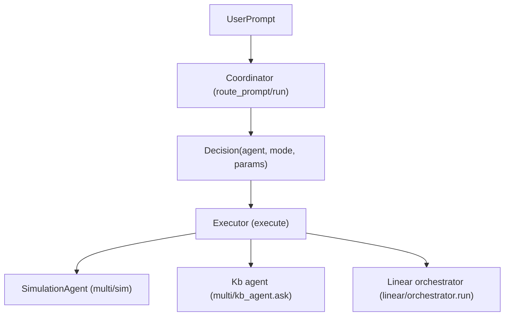

# Architecture

## Layout

- All application code lives under **`src/`**.
- Config and env stay at project root: `.env`, `requirements.txt`, `ARCHITECTURE.md`.

## LLM Wrapper

- **`src/wrapper.py`**: Single module that exposes a unified chat interface and switches between LLM providers via environment variable.
- **Interface**: `complete(messages: list[dict]) -> str`
  - **Input**: List of message dicts with `role` (`"user"`, `"assistant"`, `"system"`) and `content` (string).
  - **Output**: Assistant reply as a single string.
- **Default provider**: OpenAI. Set `LLM_PROVIDER=anthropic` in `.env` to use Anthropic.

## Environment variables

| Variable | Purpose |
|----------|---------|
| `LLM_PROVIDER` | `openai` (default) or `anthropic` |
| `OPENAI_API_KEY` | OpenAI API key (required when provider is openai) |
| `ANTHROPIC_API_KEY` | Anthropic API key (required when provider is anthropic) |
| `OPENAI_MODEL` | OpenAI model (default: gpt-4o-mini) |
| `ANTHROPIC_MODEL` | Anthropic model (default: claude-sonnet-4-6) |
| `MAX_TOKENS` | Max tokens for Anthropic (default: 1024) |

Load from `.env` via `python-dotenv` (called in `src/wrapper.py` on import).

## Linear pipeline

- **`src/linear/`**: Linear LLM pipeline. First step is the **extractor**.
- **`src/linear/extractor.py`**: Structured extraction from task descriptions.
  - **Interface**: `extract(text: str) -> dict`
  - **Input**: Raw task description (e.g. material/simulation prompt).
  - **Output**: Parsed dict matching the material/simulation schema (top-level keys: `material_system`, `processing_conditions`, `simulation_parameters`, `computed_properties`, `uncertainty_estimates`).
  - **Provider**: Uses `LLM_PROVIDER` (same as wrapper). **OpenAI**: Structured Outputs via `response_format` and `json_schema`. **Anthropic**: Tool use (single tool with `input_schema`, optional `strict`). Reuses `OPENAI_MODEL`, `ANTHROPIC_MODEL`, `MAX_TOKENS`; no new env vars or dependencies.
- **`src/linear/processor.py`**: LLM-based symbolic reasoning on extraction-shaped data. Uses `src.wrapper.complete` only (no direct provider calls).
  - **Interface**: `process(data: dict, task: str) -> dict`
  - **Input**: `data` = extraction dict (output of `extract(...)`); `task` = one of `schema_validation`, `constraint_verification`, `feature_extraction`, `normalization`, `risk_ranking`.
  - **Output**: Task-specific result dict (e.g. schema_validation → `{"valid": bool, "issues": list[str]}`; constraint_verification → `{"plausible": bool, "warnings": list[str]}`; etc.).
  - **Tasks**: Schema validation (percentage sums, missing fields, contradictions); constraint verification (temp vs melting, strain rate, model vs scale); feature extraction (alloy class, functional category, mechanism, dimensionality); normalization (composition to fractions, temp range to array, units); risk/sensitivity ranking (property and processing rankings).
- **`src/linear/reasoning.py`**: LLM agent that produces a human-readable summary of pipeline execution. Aware of `src/linear/` structure (extractor, processor, task names and output shapes). Uses `src.wrapper.complete`.
  - **Interface**: `summarize(original_input: str, extraction: dict, processing_results: dict) -> str`
  - **Input**: Original task text, extraction dict, and a dict mapping task name → process result.
  - **Output**: Concise human-readable summary of actions taken and results obtained (no raw JSON).
- **`src/linear/orchestrator.py`**: Orchestrates the pipeline: passes input from extract → process (one or more tasks) → reasoning.
  - **Interface**: `run(input_text: str, tasks: list[str] | None = None) -> dict`
  - **Input**: Raw task description; optional list of processor task names (default: all TASKS).
  - **Output**: `{"summary": str, "extraction": dict, "processing": dict}` — human-readable summary plus full extraction and per-task results.
- **`src/linear/__init__.py`**: Exposes `extract`, `process`, `summarize`, `run`, and task constants (e.g. `from src.linear import extract, process, summarize, run, TASK_SCHEMA_VALIDATION`).

## Multi / Knowledge-Base

- **`src/multi/`**: Provider-agnostic RAG module for document indexing, retrieval, and augmented completion.
- Files:
  - **`knowledge_base.py`**: Core logic for indexing, chunking, embedding, storage, and search.
  - **`wrapper.py`**: Augmented completion entry point.
  - **`__init__.py`**: Re-exports `index`, `search`, `clear`, `store_size`, `complete_with_knowledge`.
- **Public API**: `from src.multi import index, search, clear, store_size, complete_with_knowledge`
- **Interface**:
  - `index(paths: list[str]) -> None`: Ingest documents or raw text.
  - `search(query: str, top_k: int = 5) -> list[dict]`: Retrieve top-k relevant chunks.
  - `complete_with_knowledge(messages: list[dict], query: str, top_k: int = 5) -> str`: Augment and complete.
  - `clear() -> None`: Reset in-memory store.
  - `store_size() -> int`: Get current number of stored chunks (for testing).
- **Storage**: In-memory list; no persistent DB.
- **Embeddings**: Uses OpenAI API (requires `OPENAI_API_KEY`).
- **New Environment Variables** (optional):

| Variable          | Purpose                                                        |
| ----------------- | -------------------------------------------------------------- |
| `KB_DATA_DIR`     | Default directory to scan for documents (optional convenience) |
| `EMBEDDING_MODEL` | OpenAI embedding model (default: `text-embedding-3-small`)     |

- **Data Flow**:

```mermaid
graph TD
    A[User] -->|index(paths)| B[Ingest & Chunk]
    B --> C[Embed]
    C --> D[Store in _STORE]
    A -->|search(query)| E[Embed query]
    E --> F[Cosine similarity on _STORE]
    F --> G[Top-k results]
    A -->|complete_with_knowledge(messages, query)| H[search]
    H --> I[Augment messages<br/>(provider-specific)]
    I --> J[complete()]
```

## KB Agent

- **`src/multi/file_store.py`**: Provider-aware file storage layer.
  - **OpenAI**: Creates and manages an OpenAI vector store (`client.vector_stores`) and an Assistants API assistant (`client.beta.assistants`) with `file_search` enabled. Files are uploaded via `vector_stores.file_batches.upload_and_poll`. Queries run as assistant threads; `file_citation` annotations signal a successful retrieval.
  - **Anthropic**: Delegates directly to `knowledge_base.index()` (in-memory vector store).
  - **Interface**:
    - `upload_files(paths: list[str]) -> None`: Route file upload to the active provider.
    - `query_openai(query: str) -> str`: Query the OpenAI assistant; returns response text if citations found, `""` otherwise.
    - `clear_openai() -> None`: Reset OpenAI module-level store/assistant IDs.

- **`src/multi/kb_agent.py`**: Orchestration layer — KB first, web search fallback.
  - **Interface**: `ask(query: str) -> str`
  - **Provider dispatch**:

| `LLM_PROVIDER` | KB search | Fallback |
|---|---|---|
| `openai` | `query_openai()` — file_citation present? | `OpenAI().responses.create` with `web_search_preview` |
| `anthropic` | `search()` from `knowledge_base` — non-empty? | `Anthropic().messages.create` with `web_search_20250305` |

  - **Fallback trigger**: OpenAI — `query_openai()` returns `""`; Anthropic — `search()` returns `[]`.
  - Both web search mechanisms are **first-party** (no third-party service).

- **New Environment Variables** (optional):

| Variable | Purpose |
|---|---|
| `OPENAI_VECTOR_STORE_ID` | Pre-existing OpenAI vector store ID (created at runtime if absent) |
| `OPENAI_ASSISTANT_ID` | Pre-existing OpenAI assistant ID (created at runtime if absent) |

## Simulation agent

- **`src/multi/sim/`**: Toy nickel-based superalloy optimization (cooling rate → yield strength, porosity).
- **`src/multi/sim/simulation.py`**: `run_material_simulation(cooling_rate_K_per_min, duration_hours, ...)` → `(yield_strength_MPa, success)`.
- **`src/multi/sim/agent.py`**: `SimulationAgent` runs an optimization loop (simulate → LLM suggestion → repeat).
  - **`run_optimization_loop(initial_cooling_rate_K_per_min=..., on_step=...)`**: Optional `on_step(iteration, rate, y_MPa, success)` callback for per-step reporting.
  - **`run_and_report(initial_cooling_rate_K_per_min=...)`**: Returns `(history, output_string)`. Use `output_string` in chat so the user sees simulation output (each iteration + best result summary).
  - **`format_simulation_output(history, step_lines=None)`**: Formats history as a string for display; exported from `src.multi.sim`.

**Showing simulation output in chat**: Call `agent.run_and_report(...)` and display the second return value (e.g. `print(output)` or return it in a tool response).

## Coordinator and executor

- **`src/coordinator.py`**: Routing agent that decides which downstream LLM agent to call.
  - **Interface**:
    - `route_prompt(prompt: str) -> dict`: Inspect a raw user prompt and return a decision dict of the form `{"agent": "simulation" | "kb" | "processor", "mode": "pass_through" | "structured", "params": {...}}`.
    - `run(prompt: str) -> dict`: High-level entry point that calls `route_prompt` and then delegates to the executor to actually run the chosen agent.
  - **Agents**:
    - `simulation`: The material optimization loop implemented by `src/multi/sim/agent.py`.
    - `kb`: The knowledge-base + web-search agent implemented by `src/multi/kb_agent.py`.
    - `processor`: The structured materials/simulation analysis pipeline exposed via `src/linear/orchestrator.py`.
  - **LLM provider**: Uses `src.wrapper.complete`, so provider selection and API keys come from `.env` (`LLM_PROVIDER`, `OPENAI_API_KEY`, `ANTHROPIC_API_KEY`, etc.).
- **`src/executor.py`**: Executes a validated decision dict by calling the appropriate existing agent.
  - **Interface**:
    - `execute(decision: dict, original_prompt: str | None = None) -> dict`: Run the selected agent and return a normalized result dict.
  - **Behavior**:
    - `agent="simulation"`: Instantiate `SimulationAgent` and call `run_and_report(...)`; returns `{"history": [...], "output": str}` in the `result` field.
    - `agent="kb"`: Call `kb_agent.ask(query)` where `query` comes from `params["query"]` or falls back to `original_prompt`; returns the answer string in `result`.
    - `agent="processor"`: Call `linear.orchestrator.run(input_text, tasks=...)` where `input_text` is either `params["input_text"]` or `original_prompt`; returns the orchestrator dict (`summary`, `extraction`, `processing`) in `result`.



## Testing

This is an **LLM agent pipeline**. Integration tests must use the **real LLM with ZERO mocking of any kind** (no mocks, no patch, no monkeypatch). Every agent has E2E integration tests.

- **Integration tests (E2E, real LLM, zero mocking)**: `tests/integration/`
  - `tests/integration/wrapper/` — base wrapper `complete()` with live API.
  - `tests/integration/linear/` — linear pipeline: extract → process → summarize → run with live API (OpenAI; Anthropic skipped — extractor schema exceeds API union-type limit).
  - `tests/integration/multi/` — knowledge base, file store, kb_agent, complete_with_knowledge with live API.
  - `tests/integration/sim/` — simulation agent optimization loop with real LLM.
  - Require `OPENAI_API_KEY` and/or `ANTHROPIC_API_KEY` in `.env`; skipped when none set. For Anthropic-specific E2E, set `LLM_PROVIDER=anthropic` in `.env`.
  - Run: `python -m pytest tests/integration/ -v`
- **Unit tests (may mock LLM)**: `tests/test_*.py`
  - Fast feedback during development; they do **not** replace integration tests.
  - Run: `python -m pytest tests/ -v` (full suite includes both unit and integration).

## Tooling and agents

- **Integration testing agent**: `.cursor/skills/integration-testing/SKILL.md` — Runs pytest from project root. **Integration tests** = E2E tests in `tests/integration/` with real LLM; do not omit or mock the LLM for integration. Trigger: "run integration tests", "run tests", "verify the build", "make sure tests pass".
